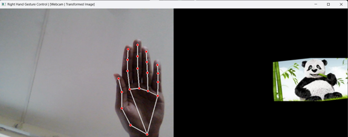

# Hand Gesture Controlled Image Transformation

Control image transformations (scale, rotation, position) using hand gestures via webcam, powered by MediaPipe.

## Features
- **Pinch-to-Scale**: Adjust image size with thumb-index finger distance
- **Rotation Control**: Rotate image by changing finger angle
- **Position Control**: Move image using wrist movement
- **Real-time Preview**: Side-by-side webcam and transformed image view
- **Reset Function**: Press 'r' to reset transformations
- **Quit Function**: Press `q` to exit the application

## Prerequisites
- Python 3.7+
- OpenCV (`pip install opencv-python`)
- MediaPipe (`pip install mediapipe`)
- NumPy (`pip install numpy`)

## Installation

```py
pip install opencv-python mediapipe numpy
```

## Usage
1. **Run the script**:
```
python gesture_transform.py
```

2. **Select image** from available files (shown in terminal):
```
Enter image filename (example: image.jpeg): your_image.jpg
```

3. **Gesture controls**:
- ✌️ Right hand only detection
- 🤏 Pinch thumb-index to scale
- 🔄 Rotate by changing finger angle
- 🖐 Move image using wrist position

4. **Keyboard controls**:
- `r`: Reset transformations
- `q`: Quit application

## 🖼 Sample Input/Output
### Initial Setup


### Image Loading


### Zoom-in 


### Zoom-out


### Rotation Clockwise


### Rotation Counter-Clockwise


### Translation - Left 


### Translation - Right



### Translation - Up


### Translation - Down


## ⚠️ Troubleshooting
1. **Image not found**:
- Verify image is in same directory
- Check filename spelling/case sensitivity

2. **Webcam issues**:
- Ensure no other app is using webcam
- Grant camera permissions in system settings

3. **Dependency errors**:
- Create virtual environment: `python -m venv venv`
- Install requirements: `pip install -r requirements.txt`

---
